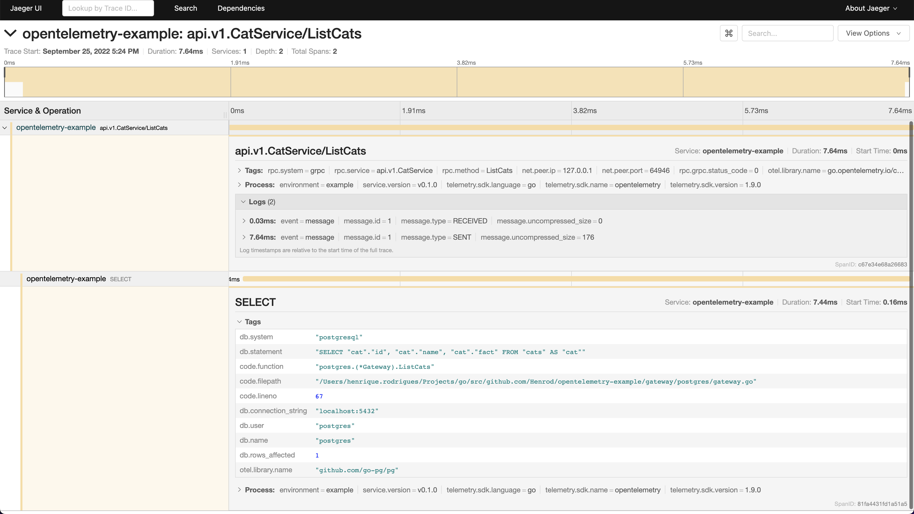
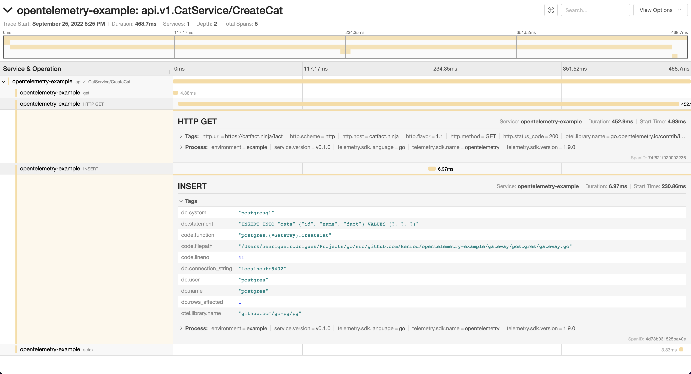
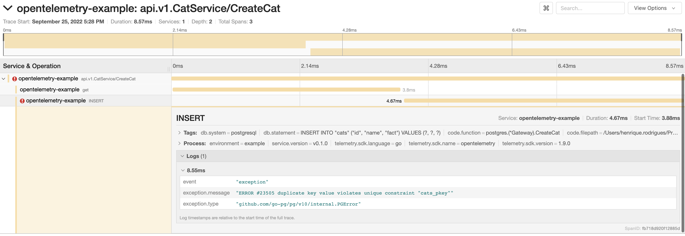

# OpenTelemetry Example

## Objective

Write an example on how to use OpenTelemetry with:
1. HTTP Client
2. gRPC Server
3. Postgres Client
4. Redis Client

This example consists of a Cat API, where cats are registered along with cat facts.

## Running

Start Jaeger, Postgres and Redis:

```shell
make deps
make migrations
```

Run the application:

```shell
make run
```

Call the API:

Create a cat:
```shell
grpcurl \
  -d '{ "cat": { "name": "Tom", "id": "tom" } }' \
  -plaintext localhost:8080 \
  api.v1.CatService/CreateCat
```

Create another cat (if within 10s, the same cat fact will be used from cache):
```shell
grpcurl \
  -d '{ "cat": { "name": "Garfield", "id": "garfield" } }' \
  -plaintext localhost:8080 \
  api.v1.CatService/CreateCat
```

List cats:
```shell
grpcurl \
  -plaintext localhost:8080 \
  api.v1.CatService/ListCats
```

Find the traces in [Jaeger UI](http://localhost:16686):

* List cats


* Create cat


* Create already existing cat

